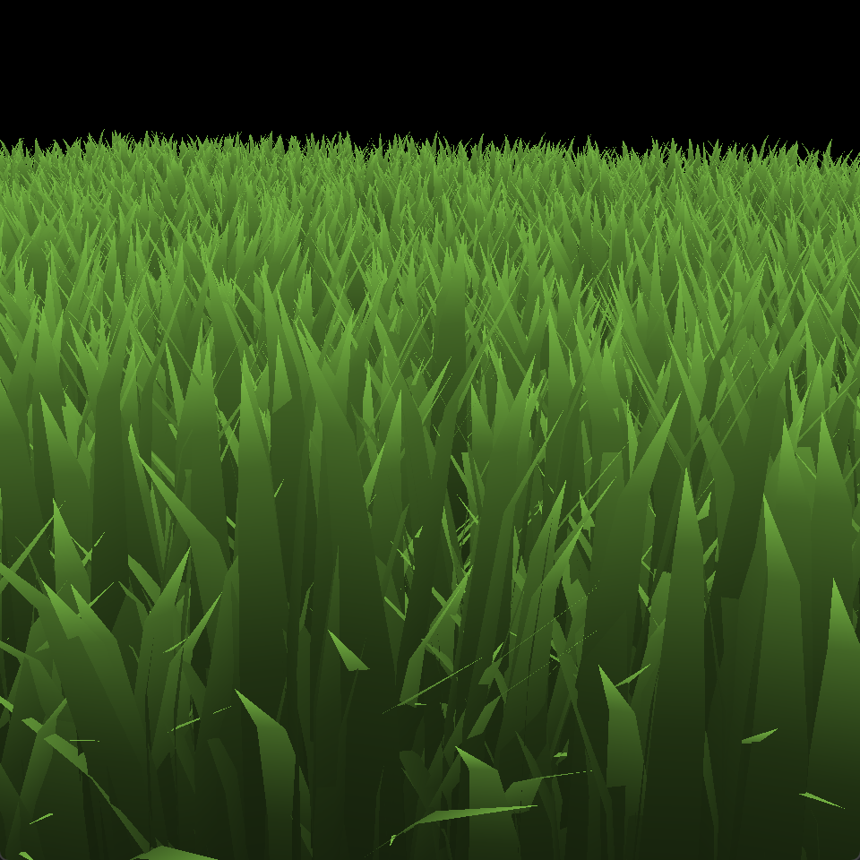

# Vulkan Grass Rendering

**University of Pennsylvania, CIS 565: GPU Programming and Architecture, Project 5**

-   Jinxiang Wang
-   Tested on: Windows 11, AMD Ryzen 9 8945HS w/ Radeon 780M Graphics 4.00 GHz 32GB, RTX 4070 Laptop 8 GB

### Features Implemented:

1. Vulkan grass render pipeline
2. Force simulation (gravity, recovery, wind)
3. Culling (orientation, view-frustum, distance)
4. Grass blade tessellation
5. Distance based tessellation

## Forces

| Gravity                  | Recovery                  | Wind                  |
| ------------------------ | ------------------------- | --------------------- |
|  |  |  |

## Culling

---

### Orientation Culling

**Orientation culling** is calculated by the absolute value of dot product between blade's **width orientation** and **xz direction of view direction**

| Culling Off                | Threshold = 0.1            | Threshold = 0.3            | Threshold = 0.6            | Threshold = 0.9            |
| -------------------------- | -------------------------- | -------------------------- | -------------------------- | -------------------------- |
|  |  |  |  |  |

### View-Frustum Culling

**View-frustum culling** is determined by whether or not a blade is inside view frustum's AABB

| Culling Off                   | Culling On                   |
| ----------------------------- | ---------------------------- |
|  |  |

### Distance Culling

In **distance culling**, we calculate distance between camera, and decide whether or not this blade is culled by computing **threshold < (dist - minDist) / fadeDist**

| Culling On            |
| --------------------- |
|  |

## Tessellation

A **distance based tessellation** is performed in this project. By using similar concept introduced in Distance Culling, we lerp between preset min and max edge factors.  

### Developing progress

| Setup and Bind Resources   | Fixed Orientation       | Add Forces and Culling |
| -------------------------- | ----------------------- | ---------------------- |
|  |  |  |

### Performance Analysis

Scene Spec:

| Resolution | Num Blades       |
| ---------- | ---------------- |
| 1080x1080  | 262144 (1 << 18) |

Results:

|              | No Culling | Orientation Culling | View Frustum Culling | Distance Culling |
| ------------ | ---------- | ------------------- | -------------------- | ---------------- |
| FPS          | 112        | 136                 | 184                  | 189              |
| FPS Increase | 0          | 24                  | 48                   | 5                |
